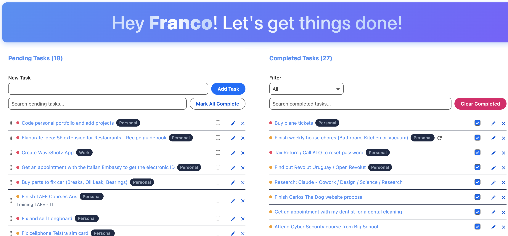
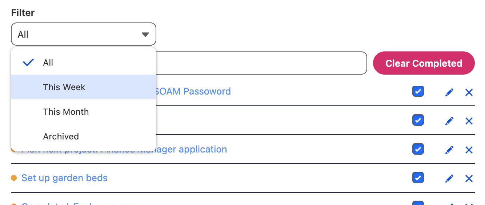
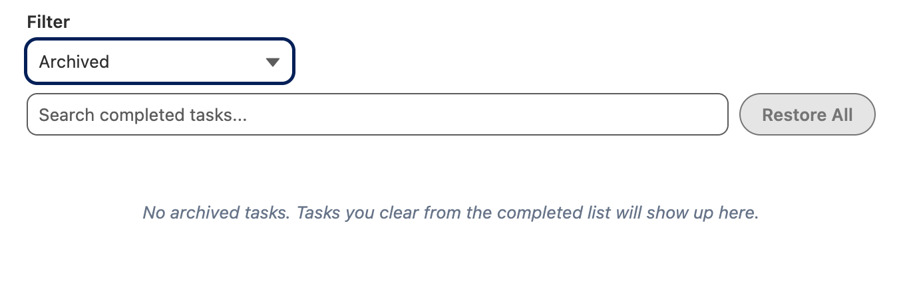

# Salesforce To Do App

A secure, feature-rich personal task manager built entirely on the Salesforce Platform, using Lightning Web Components (LWC) and Apex. No due dates, no clutter — just a fast, personal to-do list with the extras that make daily task management actually pleasant: priorities, categories, notes, recurring tasks, drag-and-drop ordering, archiving, and undo.

## Screenshots

**Rotating motivational quote** — sits at the top of the app page for a bit of daily motivation, auto-advancing every 60 seconds (or jump to any quote via the dots):


**Pending and Completed lists side by side** — priority dots, category pills, search, and bulk actions (Mark All Complete / Clear Completed) on both sides:



**Completed list filter** — switch between All, This Week, This Month, and Archived:



**Archived view** — tasks cleared from the Completed list land here, with per-task Restore and a "Restore All" bulk action:



## Features

### Core task management
- Create, rename, complete/un-complete, and delete tasks
- **Priority levels** (High / Medium / Low) shown as a colored dot on each task
- **Categories** (Work, Personal, Errands, Shopping, Other) shown as a pill
- **Notes** — a free-text field per task, with a truncated preview on the row
- **Recurring tasks** (Daily / Weekly / Monthly) — completing a recurring task automatically schedules and creates its next occurrence
- **Drag-and-drop reordering** of pending tasks, persisted per user
- **Live search** by task name (debounced, server-side), on both the pending and completed lists
- **Pagination** — both lists page in windows of 15, with Previous/Next controls and a "Page X of Y" indicator, so the list stays fast no matter how many tasks pile up

### Bulk actions & safety nets
- **Mark All Complete** — completes every pending task in one click
- **Clear Completed** — *archives* completed tasks (hides them from the list) rather than deleting them
- **Archived filter + Restore / Restore All** — bring archived tasks back individually or all at once
- **Undo Delete** — deleting a task shows a 5-second "Undo" bar before the delete is actually sent to the server
- **Task counts** — live counts on both list headers and the mobile tab bar

### Design
- Custom dark/light themed UI (dark on mobile, light on desktop) built entirely with Lightning Web Components — no reliance on standard Salesforce record pages for day-to-day use
- Fully responsive: a two-column desktop layout collapses into a tab-switcher on mobile
- Personalized greeting banner that addresses the logged-in user by their first name

## Security

This app was built with the same rigor you'd want from any multi-tenant Salesforce app, even though it's a single-object personal tool:

- **Private sharing model** on `To_Do_Task__c` — no user can see another user's tasks by default
- **Row-level ownership checks** in every Apex method that reads or mutates a specific task (`WHERE OwnerId = :UserInfo.getUserId()`), preventing one user from viewing, editing, completing, reordering, or deleting another user's task even if they somehow obtained its record ID (IDOR protection)
- **`WITH SECURITY_ENFORCED`** on every SOQL query, enforcing object- and field-level security at query time
- **`Security.stripInaccessible()`** on every DML operation (insert/update), so a user without edit access to a given field can never have that field silently written to
- **Object-level delete check** (`isDeletable()`) before any permanent delete
- A dedicated **`To_Do_App_Access` permission set** grants the field-level access the app's custom fields require (Priority, Category, Notes, Sort Order, Recurrence, Next Occurrence Date, Archived) — Salesforce does not auto-grant FLS on fields deployed via Metadata API the way Setup UI does, so this must be assigned to any user of the app (see Deployment below)

## Architecture

```
force-app/main/default/
├── applications/
│   └── TO_DO_App.app-meta.xml            # Lightning App definition
├── classes/
│   ├── TaskController.cls                # All server-side logic (see below)
│   └── TaskControllerTest.cls            # 34 unit tests, 100% of controller logic covered
├── contentassets/
│   └── todolisticonvector.*              # App logo
├── flexipages/                           # App Home pages hosting the todoApp component
├── lwc/
│   ├── motivationalQuotes/               # Rotating motivational quote widget (top of the app page)
│   ├── todoApp/                          # Parent: greeting banner, mobile tabs, layout
│   ├── todoPendingList/                  # Pending tasks: create, edit, reorder, complete, delete
│   └── todoCompletedList/                # Completed tasks: filter, edit, restore, clear, delete
├── objects/
│   └── To_Do_Task__c/                    # Custom object + all custom fields
├── permissionsets/
│   └── To_Do_App_Access.permissionset-meta.xml
└── tabs/                                 # Custom tabs for the app and the object
```

### Apex — `TaskController`

A single `with sharing` Apex class exposes everything the UI needs via `@AuraEnabled` methods:

| Method | Purpose |
|---|---|
| `getPendingTasks(searchTerm, pageNumber, cacheBuster)` | Cacheable wire method backing the pending list — paginated (15/page), name-filtered, ordered by manual sort order |
| `getCompletedTasks(filterType, searchTerm, pageNumber, cacheBuster)` | Cacheable wire method backing the completed list — paginated and name-filtered, supports `''` (all), `WEEK`, `MONTH`, and `ARCHIVED` filters |
| `createTask(taskName)` | Creates a new pending task |
| `updateTask(taskId, newName, priority, category, notes, recurrence)` | Saves all editable fields from the inline edit form |
| `toggleTaskStatus(taskId)` | Flips a task between Pending and Completed, scheduling its next recurrence if applicable |
| `deleteTask(taskId)` | Permanently deletes a task |
| `reorderTasks(orderedTaskIds, startIndex)` | Persists a new drag-and-drop order for the pending list, offset by the current page's starting index |
| `markAllTasksComplete()` | Bulk-completes every pending task |
| `clearCompletedTasks()` | Archives (not deletes) every completed task |
| `restoreArchivedTask(taskId)` / `restoreAllArchivedTasks()` | Un-archives one or all archived tasks |
| `materializeDueRecurrences()` | Called once when the pending list loads; creates the next occurrence for any recurring task whose scheduled date has arrived |

Both list methods return a `PagedTasks` wrapper (`records` + `totalCount`) so the client can render "Page X of Y" and disable Next appropriately from a single round trip. Pages are 15 records via SOQL `LIMIT`/`OFFSET`, and the UI debounces search input by 300ms before committing it to the wire (which also resets back to page 1).

The `cacheBuster` parameter exists to work around a real Lightning Data Service gotcha: cacheable `@wire` methods cache per unique parameter combination, and `refreshApex()` only busts the cache entry for the *currently active* parameters. Without it, a mutation made on one page (or filter, or search term) could leave a stale cached response under a different page/filter/search that the client had already queried earlier in the session. `cacheBuster` increments on every mutation, guaranteeing a fresh server call the next time any combination, old or new, is selected. `reorderTasks`' `startIndex` exists so dragging a task within page 2 (say) assigns `Sort_Order__c` values starting at 15 instead of 0, so it doesn't collide with page 1's ordering — only one page's tasks are ever in the DOM at a time.

### LWC components

- **`motivationalQuotes`** — a self-contained widget at the top of the app page: a rotating carousel of motivational quotes with a 60-second auto-advance, dot navigation, and a countdown progress bar. No Apex or object dependencies — just a static quote library
- **`todoApp`** — the parent shell: personalized greeting banner, mobile tab bar with live counts, and the two-column (desktop) / tab-switched (mobile) layout
- **`todoPendingList`** — the active task list: quick-add, search, drag-and-drop reorder, inline editing (name/priority/category/notes/recurrence), bulk complete, and optimistic delete-with-undo
- **`todoCompletedList`** — the history/archive view: filter dropdown (All/Week/Month/Archived), search, inline editing, restore/restore-all, clear-completed (archive), and delete-with-undo

### Data model — `To_Do_Task__c`

| Field | Type | Purpose |
|---|---|---|
| `Name` | Text | Task title |
| `Status__c` | Picklist (Pending/Completed) | Primary status |
| `Completed__c` | Checkbox | Convenience boolean mirroring Status |
| `Completed_Date__c` | Date | Set when a task is completed; drives the Week/Month filters |
| `Priority__c` | Picklist | High / Medium / Low |
| `Category__c` | Picklist | Work / Personal / Errands / Shopping / Other |
| `Notes__c` | Long Text Area | Free-form notes |
| `Sort_Order__c` | Number | Manual drag-and-drop order for pending tasks |
| `Recurrence__c` | Picklist | None / Daily / Weekly / Monthly |
| `Next_Occurrence_Date__c` | Date | Internal — when the next occurrence of a recurring task should be created |
| `Archived__c` | Checkbox | Internal — hides a completed task from the normal Completed list without deleting it |

## Deployment

Requires the [Salesforce CLI](https://developer.salesforce.com/tools/salesforcecli).

```bash
# 1. Authorize the target org
sf org login web --alias myOrg

# 2. Deploy all metadata
sf project deploy start --target-org myOrg

# 3. Assign the permission set that grants field-level access to the app's custom fields
sf org assign permset --name To_Do_App_Access --target-org myOrg

# 4. Assign the app / tabs to your profile or a permission set as needed via Setup,
#    then open the "TO DO App" from the App Launcher.
```

Every user of the app needs the `To_Do_App_Access` permission set assigned — without it, Salesforce's own field-level security will correctly block access to the app's custom fields, since deploying fields via Metadata API doesn't automatically grant profile access the way creating them in Setup does.

## Testing

**Apex** — 34 tests covering every controller method, including negative cases and cross-user IDOR protection tests (verifying one user genuinely cannot read, edit, complete, reorder, or delete another user's tasks):

```bash
sf apex run test --target-org myOrg --code-coverage --result-format human
```

**LWC (Jest)** — 28 tests covering rendering, search, CRUD actions, bulk actions, undo, and cross-component state (task counts, tab switching):

```bash
npm install
npm run test:unit
```

## Known limitations

- **Recurring tasks are materialized lazily.** Completing a recurring task schedules its next occurrence for a future date, but that occurrence is only actually created the next time the pending list loads *after* that date has arrived — there's no background scheduled job. For a personal app opened regularly, this is a deliberate, low-complexity tradeoff rather than a bug.
- **Search matches task names only, not notes.** `Notes__c` is a Long Text Area field, and Salesforce doesn't allow SOQL `WHERE` clauses to filter on that field type, so server-side search is scoped to `Name`.
